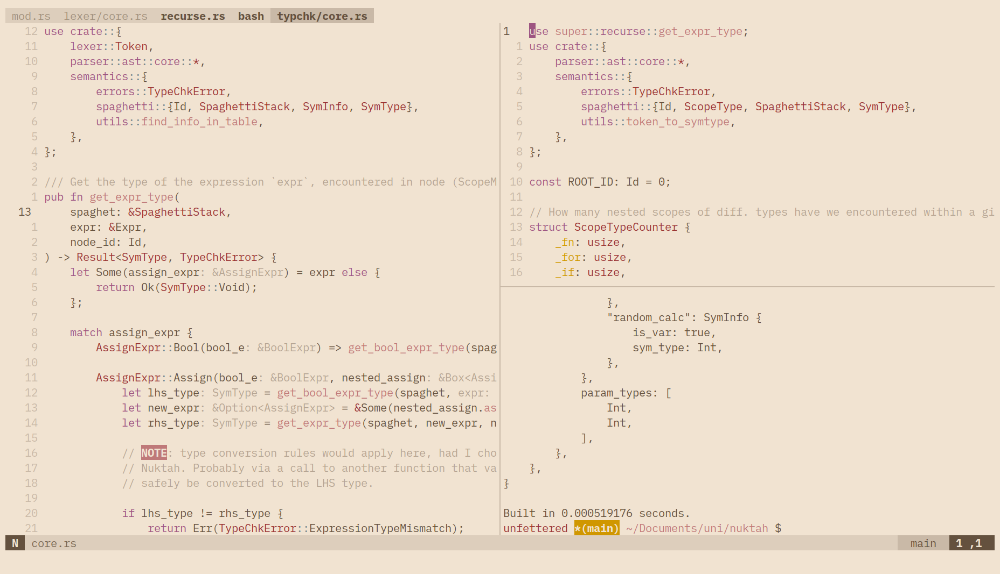

# nvim




## Installation

NOTE: All the relevant tooling will be installed by Mason automatically but you need certain system
packages, e.g `go`, `npm`, etc.; these can be installed trivially via Scoop or any Linux package
manager.

#### Linux

```bash
git clone https://github.com/masroof-maindak/nvim.git ~/.config/nvim
```

#### Windows

```powershell
mkdir $env:LOCALAPPDATA\nvim
cd $env:LOCALAPPDATA\nvim
git clone https://github.com/masroof-maindak/nvim.git .
scoop bucket add extras
scoop install neovim neovide
```
